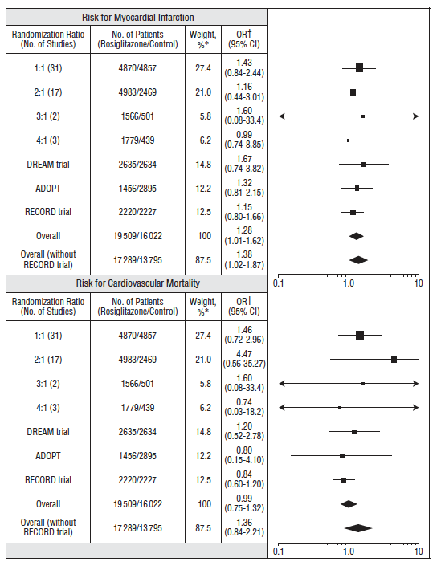

## What is Meta-Analysis?

> The analysis of analyses.
>
> -- Gene V. Glass, Primary, secondary and meta-analysis of research, Educational Researcher, 1976.

---

Conducting a meta-analysis

---

## Meta-Analysis

* Is a formal summary of *compatible* effects across multiple studies
* The summary method is typically some kind of weighted average
* All meta-analyses should be done within a systematic review
* Assessments of bias and heterogeneity are essential

--- .class #id 

## Why Meta-Analysis?

* Single summary of effect
* Increased power
* Increased generalizability
* Address questions that single studies could not
* Resolve controverisies

--- .class #id 

## When Not to Undertake a Meta-analysis

<center>

</center>

--- 

### The Fall of Vioxx

<center>

</center>

---

<center>

</center>

Drug Safety Critic Hurls Darts From the Inside, NY Times, 2007

---

### Key messages from tutorial

* Do not begin here!
* Meta-analyses are (mostly) about weighted averages of normal rvs


---

### Do not begin here!

- All meta-analyses should be part of a systematic review
	* Formulate question
	* Identify studies
	* Develop search strategy
	* Gather data
	* Summarize results (meta-analysis, if appropriate)
	* Evaluate potential biases
	
- The decision to undertake a meta-analysis comes after relevant studies are identified and assessed
- There are few and limited tools to help with early stages of systematic review


---

### Searching PubMed with <code>RISmed</code> package

```{r eval=FALSE}
EUtilsSummary(query,type="esearch",db="pubmed",...)

EUtilsGet(x,type="efetch",db="pubmed")
```
---

### Example: BCG Vaccine Trials


```{r}
library(RISmed)
query <- EUtilsSummary("BCG[tiab] trial*[tiab] placebo[tiab] controlled[tiab]")

substr(QueryTranslation(query),1,50) # PubMed query

QueryCount(query) # Number of record returned
``` 

---

### First 10 Records


```{r}
query <- EUtilsSummary("BCG[tiab] trial*[tiab] placebo[tiab] controlled[tiab]",retmax=10)
results <- EUtilsGet(query) # Methods for all NCBI Fields
ArticleTitle(results) # Method for article title
AbstractText(results)[1] # Method for abstracts
``` 

---

### Example Data Set: Tuberculosis Vaccine Trials

* 13 vaccine trials of Bacillus Calmette–Guérin (BCG) vaccine against no vaccine (Sham?)
* Primary endpoint:  Tuberculosis infection
* Possible explanatory variables include latitude of study region, treatment allocation method, year published

Colditz GA, et al. Efficacy of BCG vaccine in the prevention of tuberculosis. JAMA 1994; 271:698 –702.

---

### Example Data Set: Continuous Outcome

---

### Notation

* $Y_i$ Trial effect size
* $V_i$ Effect size variance
* $W_i = 1/V_i$ Trial weight

---

### Fixed Effects

- Normal assumption: <math>Y_i ~ N(\mu, V_i)</math>

Summary treatment effect:

<math>
\hat{\mu} = \sum W_i Y_i /\sum W_i
</math>

Variance of treatment effect:

<math>
V(\hat{\mu}) = 1/\sum W_i
</math>

Trial contribution to weighted average:

<math>
\lambda_i = W_i/\sum W_i
</math>
---

### Load and inspect *smoking* data

```{r}

library(HSAUR) # Source Package
data(BCG)
str(BCG)

```

--- 

### Packages for performing meta-analysis


```{r}
library(meta)
library(metafor)
library(rmeta)

```


---

### Syntax for <code>meta.MH</code>

```{r eval=FALSE}

meta.MH(ntrt, nctrl, ptrt, pctrl, conf.level=0.95, data = NULL, ...)

```

- <code>ntrt</code>: Number in treatment group
- <code>nctrl</code>: Number in control group
- <code>ptrt</code>: Number of events in treatment group
- <code>pctrl</code>: Number of events in control group

---

```{r}
rmeta.BCG <- meta.MH(BCGVacc, NoVacc, BCGTB, NoVaccTB, data = BCG)
summary(rmeta.BCG)
```

---

```{r eval=FALSE}
rma(yi, vi, sei, weights, ai, bi, ci, di, n1i, n2i, x1i, x2i,
        t1i, t2i, m1i, m2i, sd1i, sd2i, xi, mi, ri, ti, sdi, ni, mods,
        measure="GEN", intercept=TRUE, data, slab, subset,
        add=1/2, to="only0", drop00=FALSE, vtype="LS",
        method="REML", weighted=TRUE, knha=FALSE,
        level=95, digits=4, btt, tau2, verbose=FALSE, control)
```

---

```{r}
BCG$BCGNeg <- BCG$BCGVacc-BCG$BCGTB # Not infected
BCG$NoVaccNeg <- BCG$NoVacc-BCG$NoVaccTB # Not infected
metafor.BCG <- escalc(measure = "OR", ai=BCGTB, bi=BCGNeg, ci=NoVaccTB, di=NoVaccNeg, data = BCG)
summary(metafor.BCG)
```

---
```{r}
metafor.BCG <- rma(method="FE", 
					 measure = "OR", 
					 ai=BCGTB, bi=BCGNeg, ci=NoVaccTB, di=NoVaccNeg, data = BCG)
summary(metafor.BCG)
```

---

```{r}
# CONVERT TO ODDS RATIO SCALE
exp(metafor.BCG$b)
exp(c(metafor.BCG$ci.lb, metafor.BCG$ci.ub))
```
---

```{r eval=FALSE}
metabin(event.e, n.e, event.c, n.c, studlab,
        data=NULL, subset=NULL, method="MH",
        sm=ifelse(!is.na(charmatch(method, c("Peto", "peto"),
                                   nomatch=NA)), "OR", "RR"),
        incr=0.5, allincr=FALSE, addincr=FALSE, allstudies=FALSE,
        MH.exact=FALSE, RR.cochrane=FALSE,
        level=0.95, level.comb=level,
        comb.fixed=TRUE, comb.random=TRUE,
        hakn=FALSE,
        method.tau="DL", tau.preset=NULL, TE.tau=NULL,
        method.bias=NULL,
        title="", complab="", outclab="",
        label.e="Experimental", label.c="Control",
        label.left="", label.right="",
        byvar, bylab, print.byvar=TRUE,
        print.CMH=FALSE, warn=TRUE)

```
---

```{r}
meta.BCG <- metabin(BCGTB, BCGVacc, NoVaccTB, NoVacc, data = BCG, method="MH")
summary(meta.BCG)
```
---

Resources
===

- http://cran.r-project.org/web/views/ClinicalTrials.html
- http://handbook.cochrane.org/


